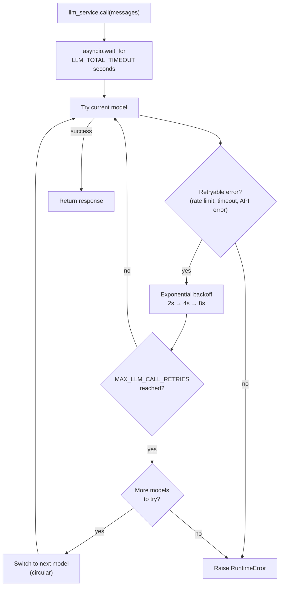

# LLM Service

## Overview

The LLM service (`app/services/llm.py`) handles all language model calls with automatic retries, circular model fallback, and a total timeout budget. Your agent code calls `llm_service.call(messages)` — the service handles everything else.

## Model registry

Models are defined in `LLMRegistry.LLMS` in order of preference:

| Name           | Model        | Notes                                  |
| -------------- | ------------ | -------------------------------------- |
| `gpt-5-mini`   | gpt-5-mini   | Default. Low reasoning effort.         |
| `gpt-5.4`      | gpt-5        | Medium reasoning effort.               |
| `gpt-5.4-nano` | gpt-5.4-nano | Fast, low reasoning effort.            |
| `gpt-5`        | gpt-5        | Full model, production-tuned sampling. |

Set `DEFAULT_LLM_MODEL` in your `.env` to choose the starting model.

To add or change models, edit `LLMRegistry.LLMS` in `app/services/llm.py`.

## Retry and fallback behaviour



**Retry config** (per model):

- Max attempts: `MAX_LLM_CALL_RETRIES` (default: 3)
- Wait: exponential backoff, 2s min, 10s max
- Retries on: `RateLimitError`, `APITimeoutError`, `APIError`

**Total timeout**: `LLM_TOTAL_TIMEOUT` seconds (default: 60s) caps the entire loop. Without this, worst case is `retries × models × max_wait` — potentially 2+ minutes.

**Fallback order**: circular through `LLMRegistry.LLMS`. After the last model, wraps back to the first and stops after one full cycle.

## Tools

Tools are bound to the LLM at startup:

```python
llm_service.bind_tools(tools)
```

When a model is switched during fallback, the tools are re-bound to the new model automatically.

## Adding a new model

```python
# app/services/llm.py — LLMRegistry.LLMS
{
    "name": "gpt-5.4",
    "llm": ChatOpenAI(
        model="gpt-5.4",
        api_key=settings.OPENAI_API_KEY,
        max_tokens=settings.MAX_TOKENS,
    ),
},
```

Add it at any position in the list. The fallback order follows the list order.
